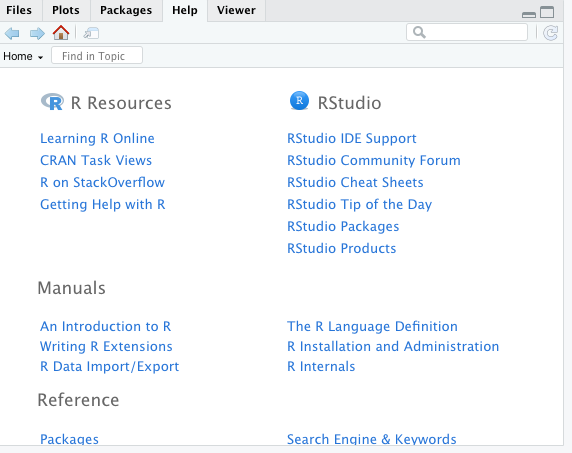

```{r setup, include=FALSE}
knitr::opts_chunk$set(echo = TRUE)
```
## RStudio
RStudio es un entorno de desarrollo integrado (IDE) para el lenguaje de programación R.

## Partes de RStudio


La interfaz de RStudio se divide en cuatro paneles y un menú superior.

- **La consola**

En la consola de la interfaz de RStudio se pueden hacer cálculos y operaciones matemáticas. La consola se puede usar como una calculadora:


- **El editor**

En este panel se crean y modifican los scripts. Un script es un documento de texto en el que se escriben líneas de código R para el análisis de datos(archivos que tienen extensión .R) y para crear documentos (archivos con extensión .Rmd). En las líneas de código de R se tienen funciones y comentarios de lo que se va realizando. Así,  la utilidad de poder escribir scripts nos ayuda a poder leer, limpiar, visualizar datos, escribir documentos y poder reproducir o verificar (pueden ser útiles en auditorias) estos en un futuro. 


- **El entorno de variables**

En este panel se ven todas las variables y data frames que hemos creado. En la pestaña Enviroment tenemos “y” y “datos”. Además, al dar click en el traingulo que se ubica a lado de _datos_ vamos a obtener detalles. Por otro lado, haciendo click sobre _datos_ podemos ver los datos del lado derecho de la imagen en forma de hoja de cálculo. Así mismo, en la pestaña History se guarda un historial de todas las operaciones que se han ejecutado en la consola 


- **Las utilidades**

Este panel se tiene la pestaña de archivos (Files) en el que se puede navegar como si fuese un explorador, en la pestaña de gráficas (Plots) podemos movernos entre todas las visualizaciones que hayamos hecho, hacer zoom y guardar las gráficas. En la pestaña Packages se pueden instalar o cargar paquetes. Por otra parte, en la pestaña Help se puede obtener ayuda de las funciones de R. Por último, en la pestaña Viewer se pueden ver gráficos interactivos. 




El menú superior tiene varias opciones de configuración y ayuda.

## Cambiar el color del  fondo

Click en Tools -> Global options -> Appearance

Elegir un tema en la sección _Editor theme:_
Click en Apply para ver como cambia el color de el entorno de RStudio.

Al haber elegido un tema click en OK.


## Ver Hojas de referencia
Se puede ver un resumen de Rstudio y de algunos paquetes de R.

Help -> Cheatsheets


